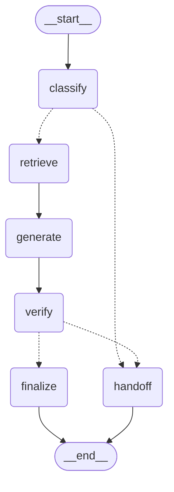

# REPORT — 후킹포인트 편집실 문의 라우팅 에이전트

## 1. 주제와 근거 문서

**주제**: 영화·드라마 편집실 "후킹포인트(Hooking Point)"로 들어오는 카카오톡 문의를 응대하는 라우팅 에이전트. 문의자는 대개 제작사·PD·감독이며, 문의는 "이 편집실이 어떤 곳인지", "편집실/편집감독에 대한 정보", "실제 작업이 어떻게 진행되는지", "연락하고 싶다"는 네 갈래로 실제로 갈린다.

**근거 문서를 고른 이유**: 편집실 대표(선다비 감독)가 직접 정리해준 실제 소개문·필모그래피·인력·위치·협력사·장르별 작업 프로세스·연락처 안내문을 그대로 근거로 썼다. 가공하거나 요약하지 않고 원문을 `docs/*.md`에 그대로 넣은 이유는, 답변 생성 단계에서 "근거에 있는 문장만 쓰라"는 제약을 걸 때 원문 그대로여야 검증(그라운딩 체크)이 의미가 있기 때문이다. 요약본을 근거로 쓰면 "요약이 원문을 왜곡했는지"까지 검증해야 하는 문제가 하나 더 생긴다.

## 2. 카테고리 설계

카테고리는 편집실 측이 실제로 문의를 분류해 정리해준 4개 구분(후킹포인트 소개 / 편집실 정보 / 작업 방식 / 연락)을 그대로 쓰고, 여기에 어디에도 속하지 않는 문의를 담는 `unclear`(넘기기)를 추가해 총 5개로 만들었다.

- **왜 이 4개인가**: 담당자 입장에서 "이 문의에 뭘로 답해야 하는가"가 문서 구분과 정확히 일치한다 — 편집실이 이미 이 4갈래로 안내 문서를 나눠서 갖고 있었다. 즉 "실제 문의 분포/문서 구분/처리 방식의 차이"가 세 기준 모두에서 같은 경계선으로 떨어진다.
- **intro vs studio_info가 헷갈리는 지점**: 둘 다 "편집실에 대한 이야기"지만, intro는 "할 수 있는지/어떤 방식인지"(역량·철학·범위)를 묻는 질문이고 studio_info는 "실제로 해봤는지/무엇을 가졌는지"(구체적 실적·인력·위치)를 묻는 질문이다. 이 구분 규칙은 `prompts.py`의 `CLASSIFY_SYSTEM_PROMPT` 규칙 2에 명시했다.
- **work_process의 경계**: "구성을 바꾸고 싶으면 어떻게 되나요?" 같은, 이미 진행 중인 작업의 구체적 절차를 묻는 질문은 겉보기에 "할 수 있나요?" 류의 intro 질문과 비슷하게 읽힐 수 있어 실제로 초기 구현에서 오분류가 났다 (§4 참고). 규칙 4로 명시적으로 분리했다.

### 카테고리 ↔ 근거 문서 매핑표

| 카테고리 | 의미 | 근거 문서 | 비고 |
|---|---|---|---|
| `intro` | 편집 철학, 커버 가능한 장르/형식(역량·범위), 프리 단계 참여 여부 | `docs/intro.md` | |
| `studio_info` | 편집감독 프로필, 필모그래피, 인력, 툴/포맷, 위치, 협력사 | `docs/studio_info.md` | |
| `work_process` | 가편집·수정 절차, 일정, 전달물, 계약, 크레딧 | `docs/work_process.md` | 장르(단편/독립장편·상업영화/드라마)별로 절차가 다름 |
| `contact` | 전화/미팅 요청, 문의 개시 등 접촉 의도 | `docs/contact.md` | |
| `unclear` | 위 4개 중 어디에도 속하지 않거나, 문서에 답이 없는 문의 | (없음) | 근거 조회 자체를 하지 않고 바로 넘기기 |

이 매핑은 `context.py`의 `CATEGORY_DOCS` 딕셔너리에 그대로 구현되어 있고, `agent.py`의 `retrieve` 노드가 분류된 카테고리에 해당하는 문서 **하나만** 프롬프트에 넣는다 (전체 `docs/`를 다 넣지 않음).

연결할 근거가 없는 카테고리는 없었다 — 편집실 측이 준 4개 구분이 이미 문서와 1:1로 대응했기 때문에 카테고리를 다시 나누거나 문서를 보강할 필요가 없었다.

## 3. 평가셋 설계

두 종류의 평가셋을 분리해서 관리한다.

- **분류 전용 스모크 테스트** (이 리포트 이전 버전, 현재는 `data/goldenset.json`으로 대체): 74건짜리 순수 분류 정확도 테스트를 초기에 만들어 라우팅 규칙만 먼저 검증했다 (98.6%, 74건 중 73건 정답). 이 단계에서 얻은 "가능하신지"라는 표현이 접촉 의도로 오분류되는 문제를 먼저 잡았다.
- **`data/goldenset.json`** (이 리포트가 측정하는 본 평가셋): 카테고리당 4건 × 5개 카테고리 = **20건**, 균형을 맞췄다. 각 문항에 세 가지를 적었다.
  - `expected_tool`: 어느 근거 문서를 조회해야 하는가 (또는 `unclear`로 넘겨야 하는가)
  - `required_facts`: 반드시 담아야 할 사실 (근거 문서에서 그대로 뽑음 — 예: 위치 문항의 "서울 강서구", 작업기간 문항의 "한 달"/"2주")
  - `forbidden_facts`: 말하면 안 되는 것 — **문서를 안 읽었을 때 나오기 쉬운 그럴듯한 오답**을 넣었다 (예: 위치는 "강남구"·"마포구", 필모그래피는 실제로 안 한 "오징어게임"·"기생충", 연락은 근거에 없는 "전화는 지원하지 않는다")
  - `unclear` 카테고리에는 4건을 배정했고, 그중 2건("환불 정책", "촬영 장비 대여")은 **문서 4개 중 어디에도 답이 없는 질문**으로 일부러 넣었다 — 이게 없으면 "넘기기 경로"가 애초에 측정되지 않는다.
  - **평가용과 예시용 분리**: `prompts.py`의 `CLASSIFY_FEWSHOT_EXAMPLES`는 프롬프트 튜닝 참고용 5건으로, `goldenset.json`의 20건과 문구가 겹치지 않게 새로 썼다. 겹치면 "채점 대상 문항을 프롬프트에 미리 알려준 것"이 되어 평가가 의미를 잃기 때문이다.

## 4. 측정 결과

측정은 두 지표로 나눈다 — **도구 호출 적절성**(어느 근거를 조회했는가)과 **답변 적절성**(그 근거로 만든 답에 필수 사실이 다 있고 금지 표현이 없는가). `evaluate.py` 실행 결과 (2026-09-18, `gpt-4o-mini`):

### 최종 수치

| 지표 | 값 |
|---|---|
| 도구 호출 적절성 (accuracy) | **20/20 (100.0%)** |
| 도구 호출 적절성 (macro F1) | **1.000** |
| 답변 적절성 | **16/20 (80.0%)** |

### 혼동행렬 (행=정답, 열=예측)

| 정답\예측 | intro | studio_info | work_process | contact | unclear |
|---|---|---|---|---|---|
| intro | 4 | 0 | 0 | 0 | 0 |
| studio_info | 0 | 4 | 0 | 0 | 0 |
| work_process | 0 | 0 | 4 | 0 | 0 |
| contact | 0 | 0 | 0 | 4 | 0 |
| unclear | 0 | 0 | 0 | 0 | 4 |

### 채점기(LLM judge) 자체 검증

`evaluate.py`의 `sanity_check_grader()`가 매 실행 시작 시 모범 답안(1점이어야 함)·필수사실 누락 답안(0점)·금지표현 포함 답안(0점) 3종을 채점기에 먼저 통과시켜, 채점기가 최소한의 판단은 제대로 하는지 확인한다.

### 개선 시도별 기록표

| # | 변경 내용 | 도구 accuracy | 도구 macro F1 | 답변 적절성 |
|---|---|---|---|---|
| 0 | v1: 분류만 하는 라우터 (RAG 이전, 74건 분류 스모크 테스트) | 98.6% (73/74) | (미측정) | (답변 생성 없음) |
| 1 | v2 초판: LangGraph 파이프라인 + `goldenset.json` 20건 | 95.0% (19/20) | 0.949 | 70.0% (14/20) |
| 2 | ① 분류 규칙에 "구성 변경 절차 vs 참여 가능 여부" 구분 예시 추가 ② 답변 프롬프트에 "이메일 그대로 포함/근거 없는 제한사항 금지" 규칙 추가 ③ 검증 프롬프트에 부정형 환각("~는 지원하지 않습니다") 탐지 규칙 추가 ④ 채점기가 원본 목록 밖 문장을 지어내면 기계적으로 걸러내는 후처리 추가 | **100.0% (20/20)** | **1.000** | 80.0% (16/20) |

### 틀린 것 직접 읽기 — 실패 원인 분류

2번 실행 이후에도 답변 적절성에서 4건이 "실패"로 표시되는데, 실제로 원문을 다시 읽어보면 원인이 둘로 나뉜다.

**(a) 실제 에이전트 결함 — 1건**
- `gs-intro-04` ("편집 톤앤매너는 어떻게 잡으세요?"): 근거 문서는 "톤앤매너, **레퍼런스**를 잡고 작업"이라고 되어 있는데, 생성된 답변이 톤앤매너 언급만 하고 "레퍼런스"를 빠뜨렸다. 근거의 일부 사실을 답변에서 누락한 진짜 결함.

**(b) 채점기(LLM judge) 자체의 오탐/오분류 — 3건** (원본 forbidden_facts 목록 안에 있는 항목이라 §의 "지어내기 방지 필터"로는 못 걸러진 경우)
- `gs-intro-03`: 답변이 근거에 충실한데도 채점기가 "시나리오를 직접 작성"이라는 문구가 "등장했다"고 잘못 판정. 실제 답변에는 그런 표현이 전혀 없다.
- `gs-work_process-03`: 답변에 "시나리오 버전과 구성 변경 버전 두 가지를 전달"이 그대로 있는데도 채점기가 세 필수 사실을 모두 "누락"으로 판정 (활용형 차이 — "두 가지를 전달" vs "두 가지로 전달" — 를 다른 사실로 오인한 것으로 보임), 동시에 답변에 없는 "추가 비용 발생"도 등장했다고 오판.
- `gs-contact-02`: 답변의 "확인 후 안내드리겠습니다"가 근거의 "순차적으로 답변 드리겠습니다"와 의미상 같은데 채점기가 다른 사실로 취급해 누락 판정. 경계선에 있는 판단이라 완전한 채점기 결함이라 보기는 어렵다.

**결론**: 100건 만점을 목표로 채점기를 계속 튜닝하는 대신, 이번 라운드에서는 (a) 진짜 결함 1건만 남았다는 것을 원문 대조로 확인하는 데 집중했다. LLM judge 특성상 완벽한 채점기를 만들기보다, 실패를 직접 읽고 "채점기 문제 vs 실제 문제"를 구분하는 과정 자체가 이 단계에서 더 중요하다고 판단했다.

## 5. 파이프라인 구조도

`agent.py`의 LangGraph 그래프를 직접 `get_graph().draw_mermaid()`로 뽑은 것 — 손으로 그린 그림이 아니라 실제 컴파일된 그래프 그대로다.

State(`AgentState`)는 `text → category/reason → evidence → draft_answer → verification → final_answer/handoff` 순으로 채워진다.

- `classify` 노드 이후 조건부 엣지(`route_after_classify`)가 `category == "unclear"`면 근거 조회 자체를 생략하고 바로 `handoff`로 보낸다 — **카테고리를 고르는 일과 넘기는 판단을 분리**했다는 게 이 지점이다.
- 실제 카테고리로 분류된 경우 `retrieve → generate → verify`를 거치고, `verify`의 결과(`grounded` 여부)에 따라 다시 조건부 엣지(`route_after_verify`)가 `finalize`(정상 답변 채택) 또는 `handoff`(검증 실패 시 안전하게 넘기기)로 갈린다. 즉 **분류 단계의 unclear**와 **검증 실패로 인한 사후 넘기기**는 서로 다른 경로지만 같은 `handoff` 노드로 합류한다.

## 6. 데모 설계

`app.py` (Streamlit, `st.chat_input`/`st.chat_message` 기반)로 만들었다. 신경 쓴 부분:

- **답변만 보여주지 않는다**: 최종 답변 아래에 배지로 "✅ 자동 응답" / "🔀 넘김"과 분류된 카테고리·분류 근거를 바로 보이게 했다. 사람이 "왜 이 카테고리로 갔는지"를 답변과 동시에 확인할 수 있어야 라우팅 에이전트를 신뢰할 수 있다고 판단했다.
- **근거·검증 결과는 기본 접힘**: 매번 다 펼쳐두면 화면이 문서로 가득 차서, `st.expander("근거 · 검증 결과 보기")`로 필요할 때만 열어보게 했다. 열면 실제로 조회된 근거 문서 원문 전체와 `{"grounded": ..., "unsupported_claims": [...]}` 검증 결과를 그대로 JSON으로 보여준다.
- **대화 히스토리 유지**: `st.session_state.history`에 턴을 쌓아서, 여러 문의를 연달아 넣어보면서 카테고리가 이리저리 바뀌는 걸 눈으로 볼 수 있게 했다.

실제로 로컬에서 `streamlit run app.py`로 띄우고 "지구 최후의 여자도 편집하셨어요?"를 입력해 확인했다 — 카테고리 `편집실 정보`로 분류되고, 근거 문서 전체(편집감독 정보~협력사)가 그대로 조회됐고, 답변은 "네, 맞습니다. '지구 최후의 여자'는 2026년에 메인편집으로 작업한 장편영화입니다."로 나왔으며, 검증 결과는 `{"grounded": true, "unsupported_claims": []}`였다. (브라우저 화면은 이 세션에서 직접 확인함 — 스크린샷 파일로 첨부하려면 로컬에서 캡처해서 붙이면 된다.)

## 7. 프로젝트 회고

**가장 공들인 부분**: "틀린 걸 그냥 숫자로만 세지 않기"였다. 처음 goldenset을 돌렸을 때 답변 적절성이 70%로 나왔는데, 4건을 그냥 실패로 기록하고 넘어가지 않고 실제 `final_answer` 원문을 하나씩 다시 읽었다. 그 결과 진짜 버그(라우팅 오분류 1건, 이메일 누락/근거 없는 부정 표현 환각 2건)와 채점기 자체의 오판을 구분할 수 있었고, 채점기 오판은 "채점기가 원본 목록 밖의 문장을 지어내면 기계적으로 버리는" 안전장치로 상당 부분 줄일 수 있었다 (도구 정확도는 이 과정에서 95%→100%로, 답변 적절성은 70%→80%로 올랐다). 숫자만 봤으면 "채점기를 더 강하게 만들어야 하나"로 잘못된 결론을 냈을 것이다.

**향후 보완하고 싶은 점**:
- `verify` 노드가 "근거에 없는 부정 표현"(예: "전화는 지원하지 않습니다")을 한 번은 놓쳤다 — 프롬프트에 명시적 규칙을 추가해서 고쳤지만, 이런 부정형 환각은 근본적으로 LLM 판정에 의존하는 한 완전히 막기 어렵다. 규칙 기반 후처리(예: 근거에 없는 "안 됩니다/불가능합니다" 패턴을 정규식으로 한번 더 거르는 것)를 추가하면 더 안전해질 것 같다.
- 남아있는 채점기 오판(§4의 (b))을 줄이려면 `required_facts`/`forbidden_facts`를 지금보다 더 잘게 쪼개거나, 채점 모델을 `gpt-4o-mini`보다 큰 모델로 바꿔서 재실험해볼 수 있다.
- 카카오톡 채널(오픈빌더) 연동용 스킬 서버(`skill_server.py`)는 만들고 로컬에서 동기/콜백 두 경로 모두 검증했다 (`curl` + 목 콜백 서버). 다만 실제 카카오톡에서 동작하려면 카카오 계정으로 채널 개설·오픈빌더 설정·이 서버를 공개 URL로 노출하는 단계가 남아있는데, 이건 계정 로그인이 필요해 대신 해줄 수 없는 부분이라 README.md에 체크리스트로 남겨뒀다.
